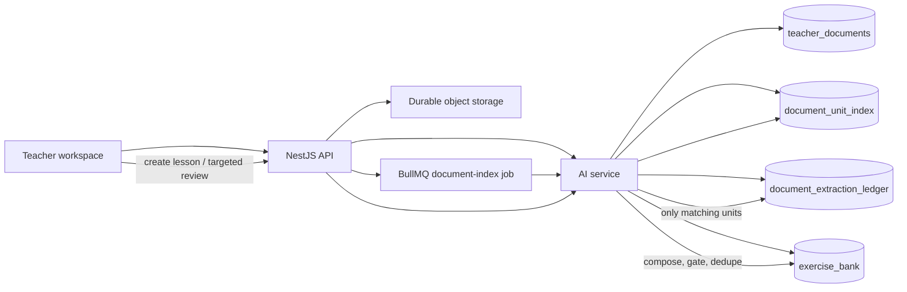
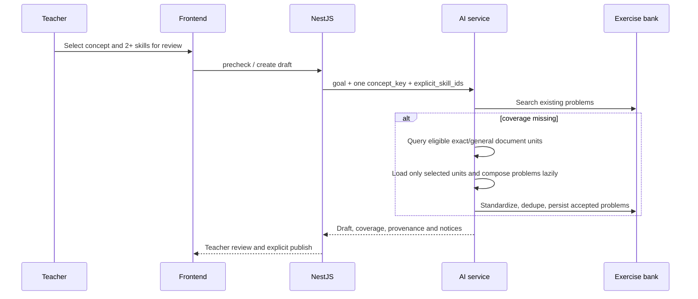

# Multi-concept document architecture

**Status:** Approved design, not implemented  
**Owners:** `new_frontend`, `edtech-backend`, `ai-service`  
**Pilot scope:** one declared subject and topic per document; targeted review within one concept.

## 1. Decision and boundaries

A teacher document is no longer forced to belong to exactly one concept. It always belongs to one closed-taxonomy `subject` and `topic`; its declared `concept_key` is optional. A document without it is a **general topic document**. It may supply material for any concept inside its declared topic, but never outside that topic.

The system indexes a document into small structural units shortly after upload. The index records which closed-taxonomy skills each unit can support. It does not create exercise-bank problems. Problem composition remains lazy and happens only when a lesson needs missing skill coverage.

The pilot supports:

- concept-scoped documents and general-topic documents;
- automatic routing only for high-confidence units;
- normal lessons and **targeted reviews**: one concept, two or more selected skills;
- teacher-visible processing status, without a UI for correcting discovered tags.

The pilot does not support documents spanning multiple declared topics, teacher edits to unit tags, OCR, or cumulative reviews across concepts. A unit that cannot be placed confidently in the declared topic is not automatically used.

## 2. Current state and gap

| Concern | Current behavior | Target behavior |
| --- | --- | --- |
| Document classification | `concept_key` is required at upload and stored in `TeacherDocumentMetadata`. | `subject` and `topic` remain required; `declared_concept_key` is nullable. |
| Upload work | Metadata only. The file is read only when a lesson is built. | Metadata is registered, then a small asynchronous structural/taxonomy index runs. |
| Extraction | Every candidate document is segmented and each unit is normalized during `ensure_coverage`. | Units are segmented and taxonomy-tagged once per index version. Only matching indexed units are composed. |
| Document lookup | `list_for_concept(concept_key)` returns exact-concept documents. | Lookup returns exact-concept documents plus eligible general-topic units that overlap requested skills. |
| Review lesson | Existing contract has one `concept_key`; no explicit review semantics. | `lesson_kind=targeted_review` uses one concept and a selected set of its skills. |

Today, `LazyStructuredExtractionService.ensure_coverage()` uses `GoalNormalizer.normalize(unit.text, metadata.concept_key)` while iterating the raw document. That makes a document with no concept impossible to register and means a general document is repeatedly scanned to find relevant units. The target separates **unit discovery** from **lazy problem composition**.

## 3. Core invariants

1. Taxonomy is closed. Every automatically usable unit has exactly one valid `concept_key` and skill IDs below that concept.
2. A document is eligible only inside its declared `subject:topic` prefix. A tag outside that prefix is recorded for diagnostics but is never an auto-use result.
3. Only `confidence >= AUTO_USE_CONFIDENCE` may enter the lesson source query. Initial configuration is `0.85`; it is a versioned configuration, not a magic permanent truth.
4. Indexing never writes `BankProblem`. Composition, standardization, duplicate detection, and teacher-review gates stay in the existing lazy extraction path.
5. Existing concept-scoped documents retain their present behavior during rollout. A missing index can be created on demand; no all-history reprocessing is required.
6. A general document must never make a lesson appear covered merely because it is in the same topic. Coverage is proved by a high-confidence unit/skill overlap and then by accepted bank problems.

## 4. Target architecture



### Ownership

- **Frontend** collects the declared subject/topic and optional concept, displays processing state, and never makes taxonomy routing decisions.
- **NestJS** authenticates the teacher, validates curriculum selections, stores the durable file, registers metadata with the AI service, and schedules/retries the `document-index` BullMQ job.
- **AI service** owns raw-file reading, segmentation, closed-taxonomy classification, Mongo persistence, eligibility queries, and lazy composition.
- **Object storage** retains the durable object key. Signed preview URLs are browser only and must never be used by a worker.

## 5. Data model

### 5.1 `teacher_documents` changes

Replace the required model field `concept_key` with the following compatible fields:

```python
class TeacherDocumentMetadata(BaseModel):
    document_id: str
    owner_user_id: str
    subject: str
    topic: str
    declared_concept_key: str | None = None
    scope_kind: Literal["concept", "general_topic"]
    storage_uri: str
    checksum: str
    filename: str
    content_type: str | None = None
    size_bytes: int
    visibility: DocumentVisibility
    index_status: IndexStatus
    index_version: str | None = None
    index_confidence: float = 0
    index_summary: DocumentIndexSummary = DocumentIndexSummary()
    index_error: str | None = None
```

`scope_kind=concept` requires `declared_concept_key` whose prefix is exactly `{subject}:{topic}:`. `scope_kind=general_topic` requires that the concept key is null. `parse_status` becomes `index_status`; the old name should be read during migration but not emitted by new contracts.

`IndexStatus` is `pending | indexing | ready | needs_manual | failed`. A document with zero usable units is `needs_manual`, not `ready`.

### 5.2 New `document_unit_index` collection

One record represents one atomic extractable unit, normally a heading section, a page fragment without headings, or a block of exercises. The segmenter must split a multi-concept section further when possible. If it cannot, the unit is ambiguous and is excluded from automatic routing.

```json
{
  "unit_key": "doc-123#h2-04",
  "document_id": "doc-123",
  "owner_user_id": "teacher-9",
  "subject": "math8",
  "topic": "polynomials",
  "declared_concept_key": null,
  "source_locator": { "page_start": 4, "page_end": 5, "heading_path": ["Bai 3"] },
  "text_fingerprint": "sha256:...",
  "primary_concept_key": "math8:polynomials:factorization",
  "skill_ids": ["math8:polynomials:factorization#common-factor"],
  "confidence": 0.91,
  "classification_status": "eligible",
  "index_version": "unit-index-v1",
  "taxonomy_version": 1,
  "created_at": "...",
  "updated_at": "..."
}
```

`classification_status` is `eligible | below_threshold | outside_declared_topic | ambiguous | unsupported`. Store low-confidence and rejected records for observability; only `eligible` records participate in lookup. Do not persist unit body text in this collection unless privacy policy explicitly permits it; the worker reloads the source from durable storage for composition.

Required indexes:

- unique `(document_id, unit_key, index_version, taxonomy_version)`;
- `(owner_user_id, subject, topic, primary_concept_key, classification_status)`;
- `(document_id, classification_status)`;
- `(skill_ids, classification_status)` as a multikey index.

### 5.3 Extraction ledger evolution

Keep the current ledger identity but make it explicitly versioned by the index that selected the unit:

`{document_id}#{unit_key}:{index_version}:{extractor_version}:{taxonomy_version}`.

This preserves idempotency if a classifier or taxonomy changes. Ledger `DONE` means the unit was composed and its accepted bank-problem IDs were recorded; it does not mean every skill in the unit is covered forever.

## 6. Light-index pipeline

The index job is idempotent and may safely be retried. Its job ID is `document-index:{document_id}:{checksum}:{index_version}:{taxonomy_version}`.

1. Read `TeacherDocumentMetadata` and durable `storage_uri`.
2. Extract readable text. PDF/DOCX/MD/TXT keep current supported-format rules; image content and unreadable content become `needs_manual`. OCR is explicitly out of scope.
3. Run deterministic structural segmentation by heading, page boundary, and exercise block. Limit unit size; split oversized sections before classification.
4. Retrieve a small candidate set from the closed taxonomy for the declared `subject/topic`, using lexical/embedding signals.
5. Run a bounded taxonomy classifier only for uncertain units. It may return only a candidate concept and candidate skills; free-text concepts are invalid. It returns confidence and evidence offsets. This is semantic classification, not question generation.
6. Validate that one concept and all skill IDs belong to the declared topic. Split or mark ambiguous if the unit covers multiple concepts.
7. Persist `document_unit_index` atomically enough that duplicate jobs converge, then update the document summary/status and invalidate teacher Copilot context.

The first three steps are cheap and deterministic. The classifier is batched and only used where retrieval is uncertain; it must be separately metered from exercise composition. Classification failures must not invent tags: save `failed`/`ambiguous` and exclude the unit.

## 7. Lesson and targeted-review path

`targeted_review` is a lesson mode, not a cross-concept curriculum feature.



The source resolver receives `(owner_user_id, concept_key, requested_skill_ids)`:

1. Search existing bank problems as today.
2. If coverage or problem roles are short, find eligible units in this order: teacher-owned exact-concept documents, teacher-owned general-topic documents, shared exact-concept documents, shared general-topic documents.
3. Within each tier, rank by skill overlap, confidence, then recency. A unit is selected only when it overlaps a missing requested skill.
4. Reload and compose only selected units. Revalidate the index fingerprint against the source segment; reindex rather than compose stale content.
5. Reselect from the bank. Optional generated questions remain last-resort, require explicit teacher consent, and preserve the current approval notice.

For a normal lesson, `explicit_skill_ids` is optional and the normalized goal supplies skills. For `targeted_review`, it is required, must contain at least two unique skills, and each must share the selected `concept_key` prefix. The existing report remains skill-keyed, so no report/mastery aggregation change is needed.

`precheck` remains read-only. It may report indexed coverage and a new `source_indexing` state, but must not enqueue indexing or compose problems. If a teacher tries to create a draft while the only usable source is still indexing, the create path returns a recoverable `409 SOURCE_INDEXING`; it does not silently fall back to generated material.

## 8. API contracts

All browser traffic continues to terminate at NestJS. The AI-service index endpoint is service-to-service only and requires the existing authenticated internal call path.

### 8.1 Browser to NestJS

**`POST /exercises/upload`** (multipart)

```text
file: PDF | DOCX | MD | TXT (required)
title: string (required)
subject: string (required)
topic: string (required)
concept: string (optional; empty is general topic)
description: string (optional)
shared: boolean (required)
```

Validation: the topic belongs to subject; a non-empty concept belongs to the chosen subject/topic. The success response remains `201`, and adds:

```json
{
  "documentId": "doc-123",
  "indexStatus": "pending",
  "message": "Da luu tai lieu va dang lap chi muc."
}
```

**`GET /exercises/documents/mine`** adds `scopeKind`, nullable `concept`, `indexStatus`, `indexSummary`, and `indexError` (only a safe teacher-facing message). It never returns unit text or internal classifier reasoning.

**`POST /exercises/documents/:documentId/retry-index`** is allowed only to the owner when status is `failed` or `needs_manual`; it returns `202 { indexStatus: "pending" }`. This is a recovery action, not tag-editing UI.

**Lesson precheck/create** adds optional `lessonKind: "normal" | "targeted_review"`. For `targeted_review`, `explicitSkillIds` is required under the same single concept. The existing `concept_key` remains required for every lesson request.

### 8.2 NestJS to AI service

`POST /teacher/documents` changes `concept_key` to nullable and adds `scope_kind`. It only registers metadata.

```json
{
  "document_id": "doc-123",
  "owner_user_id": "teacher-9",
  "subject": "math8",
  "topic": "polynomials",
  "scope_kind": "general_topic",
  "concept_key": null,
  "storage_uri": "users/teacher-9/doc-123.pdf",
  "filename": "on-tap-da-thuc.pdf",
  "checksum": "sha256:...",
  "size_bytes": 42000,
  "visibility": "private"
}
```

`POST /teacher/documents/:document_id/index` is invoked by the BullMQ worker, is idempotent, and responds with current index status. The AI service owns transitions; NestJS only schedules and retries the request.

`GET /teacher/documents` adds status/summary fields. No public API exposes a list of indexed units in pilot.

## 9. Frontend UX

The upload form keeps its subject and topic controls. It changes the concept label to **“Khái niệm (không bắt buộc)”** and adds one neutral option, **“Tài liệu chung của chủ đề”**. The form may be submitted once file, title, subject, and topic are present.

Each document row displays its scope and one concise status:

- `Đang lập chỉ mục`
- `Sẵn sàng dùng`
- `Cần tải lại tài liệu có thể đọc được`
- `Chưa thể lập chỉ mục` with retry action

Do not show inferred concepts, confidence, chunks, or a correction workflow in the pilot. A general document may show “Tài liệu chung: {topic label}”. A document that is indexing remains visible and cannot falsely be presented as immediately usable.

Lesson authoring adds a normal/review mode. Choosing review retains the current subject/topic/concept cascade and reveals multi-select skills for that one concept; there is no multi-concept picker. The review draft, publish, student session, mastery, and report UI otherwise reuse current flows.

## 10. Migration and rollout

### Deploy order

1. Deploy AI service that reads both legacy `concept_key` and new scope fields, plus the new unit-index collection and internal index endpoint. Legacy writes still work unchanged.
2. Deploy NestJS contracts and BullMQ `document-index` processor behind `DOCUMENT_UNIT_INDEX_V1=false`.
3. Enable the flag for internal/pilot teachers; new uploads queue indexing.
4. Deploy frontend optional-concept/status UI after the backend flag is on.
5. Enable targeted review once index success and source-quality metrics are healthy.

### Data migration

- Existing document with `concept_key=X` becomes `scope_kind=concept`, `declared_concept_key=X`, `index_status=pending`.
- Do not index every historical document at migration time. That creates cost without evidence of demand.
- An old document is indexed when its first lesson needs missing coverage, or by a capped background backfill for recently used documents. Until then, exact-concept lookup follows the legacy raw-document extraction fallback.
- New general-topic uploads are not eligible until their index is `ready`.
- Keep the legacy `concept_key` read alias for one release window; remove it only after documents and clients have migrated.

### Rollback

Disabling `DOCUMENT_UNIT_INDEX_V1` stops general-document eligibility and routes concept-scoped documents through legacy extraction. It does not delete uploaded files, unit records, ledgers, or accepted bank problems. Database changes are additive, so rollback is application-level rather than destructive.

## 11. Verification plan

### AI service

- Model/catalog validation: optional concept only for `general_topic`; reject a concept outside declared subject/topic.
- Segment/index tests: heading split, page fallback, ambiguous unit, outside-topic tag, low confidence, unsupported/image-only source, idempotent retry.
- Resolver tests: exact and general-source ordering; no source leakage across owners, visibility, subjects, topics, or low-confidence units.
- Lazy composition tests: only selected units are loaded; ledger idempotency and stale fingerprint reindex; bank dedupe/provenance remain correct.
- Targeted-review validation: two or more same-concept skills accepted; one skill or cross-concept skill set rejected.

### NestJS

- Upload accepts no concept, sends `scope_kind=general_topic`, persists durable URI, and creates one idempotent queue job.
- Retry authorization/status restrictions and worker retry/backoff behavior.
- Document-list mapping does not leak internal errors or unit details.
- Precheck is read-only; create returns `SOURCE_INDEXING` rather than generated content when indexing is the only candidate source.

### Frontend

- Concept can be empty while subject/topic/file/title remain required.
- Document-card statuses and retry state render correctly.
- Targeted-review skill selection only lists skills for the selected concept and cannot submit fewer than two.
- Existing concept-scoped upload and normal lesson authoring regression tests pass.

### Pilot acceptance

Run at least these real documents: a single-concept worksheet, a general-topic worksheet with three concepts, an unreadable/image-heavy PDF, and a document with a misleading heading. Verify that only eligible units are used, the generated draft shows accurate source provenance, and a report remains correctly skill-keyed after a targeted review.

Track: index completion/failure rate, time to ready, classifier confidence distribution, units auto-eligible, extraction hit rate, percentage of lesson pools using general documents, fallback generation rate, and teacher rejection rate of composed problems. Audit a sampled set of eligible unit tags before lowering the confidence threshold.

## 12. Deferred extension: cumulative review

Cumulative review is intentionally not exposed in this work. It would require a new `review_scope` with multiple concept keys, per-concept coverage rules, multi-concept lesson metadata, and report semantics that preserve per-skill/per-concept mastery. It must not be implemented by passing a fake umbrella `concept_key` into the current single-concept pipeline.
