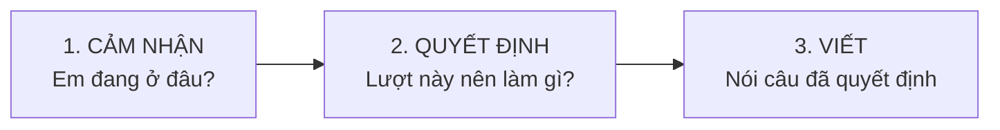
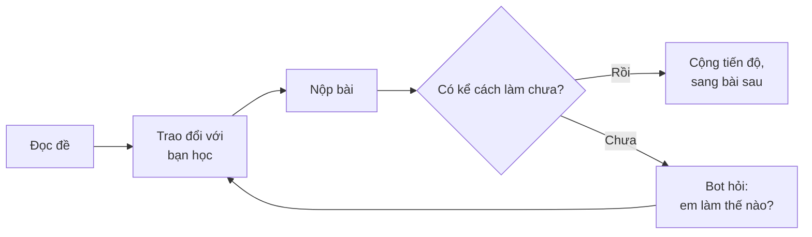
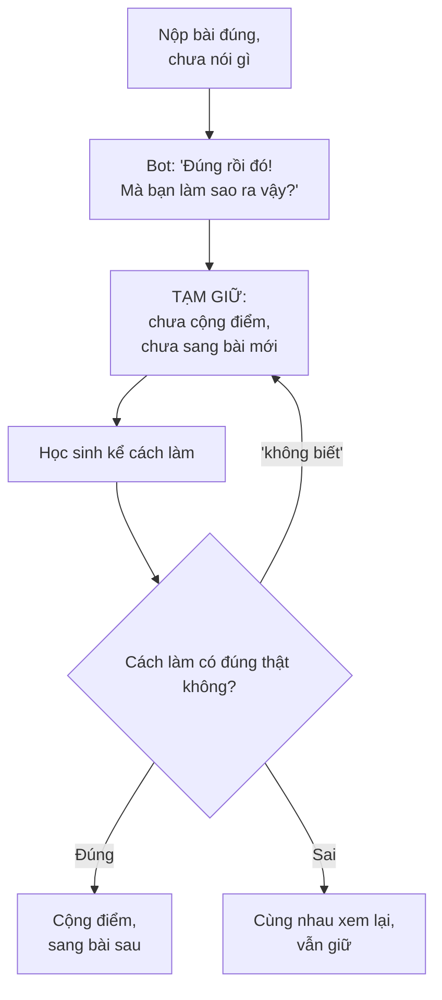

# Student Module — Tổng quan

> Dành cho người không làm kỹ thuật: product, kinh doanh, giáo viên cố vấn chuyên môn.
> Bản kỹ thuật đầy đủ: `STUDENT_MODULE_SPEC.md`.

---

## 1. Bài toán đang giải

Học sinh học một khái niệm xong vẫn không dùng được nó. Không phải vì lười, mà vì **cách các sản phẩm học tập AI hiện nay phản hồi**.

Ba vấn đề cụ thể:

1. **Máy chấm kết quả, không đọc quá trình.** Học sinh nộp "42", máy nói đúng hoặc sai. Nhưng thứ quyết định lần sau em có làm được bài tương tự hay không nằm ở *cách* em ra 42 — mà chỗ đó không ai nhìn.
2. **Một câu trả lời cố làm mọi việc cùng lúc.** Vừa khen, vừa chẩn đoán, vừa động viên, gộp vào một đoạn. Kết quả là lời khen làm loãng phần đánh giá, và một lỗi sai thật bị nói tránh cho đỡ phũ.
3. **Sai nào cũng như nhau.** Em suy nghĩ kỹ rồi sai, và em bấm bừa cho xong — nhận cùng một kiểu phản hồi. Học sinh nhận ra rất nhanh, và ngừng coi phản hồi đó là thật.

---

## 2. Ý tưởng cốt lõi: tách "hiểu" khỏi "nói"

Toàn bộ thiết kế xoay quanh một ý tưởng: **hệ thống phải hiểu xong tình huống rồi mới quyết định nói gì, và hai việc đó do hai phần khác nhau làm.**

Một lượt trả lời đi qua ba khâu tách bạch:

- **Cảm nhận** — em đang hiểu đề hay đang thực thi? cách làm có đúng không? em đang hào hứng hay sắp bỏ cuộc?
- **Quyết định** — chọn *một* việc cho lượt này: xác nhận, gợi mở, phản biện, hỏi lại cách làm, hay lùi ra động viên. Khâu này là **luật cố định**, không phải AI tự nghĩ.
- **Viết** — chỉ diễn đạt thành lời cái đã được chọn.

> **Ví von:** giống bác sĩ khám xong mới kê đơn, thay vì vừa nghe kể vừa nói luôn thuốc. Gộp hai việc thì lời động viên sẽ lấn mất phần chẩn đoán — và bệnh nhân thấy dễ chịu mà không khỏi.

Tách ra rồi thì làm được ba việc trước đây không làm được:

- **Khen mà vẫn nói thật.** Xác nhận kết quả đúng và chỉ ra chỗ yếu trong cách làm là hai việc, không phải một.
- **Phân biệt cố gắng thật với làm cho xong.** Hệ thống theo dõi em đang tiến bộ, đang giậm chân, hay đã buông.
- **Đổi luật mà không phải sửa lời.** Muốn thay đổi khi nào bot được gợi ý bước tiếp theo, sửa đúng một chỗ trong luật.

---

## 3. Học sinh trải nghiệm như thế nào

Buổi 2 gồm **đúng 4 bài**, theo thứ tự cố định:

| | Vai trò | Mục đích |
|---|---|---|
| **Bài 1** | Khởi động | Chứng minh thứ đã học ở buổi 1 |
| **Bài 2** | Đẩy | Khó hơn nhưng vẫn quen tay, em phải gắng một chút |
| **Bài 3** | Phá khuôn | Một bài lệch chuẩn, buộc em nghĩ khác đi |
| **Bài 4** | Dựng lại | Áp dụng ngay khuôn mới, đi ra với sự tự tin còn lại |

Trong suốt buổi, bot đóng vai **bạn cùng lớp đang giải chung một bài** — không phải giáo viên.

Khác biệt nằm ở cách nói:

| Bot gia sư thường nói | D-Friend nói |
|---|---|
| "Em quên đổi dấu ở bước 2, dẫn tới sai kết quả." | "Ơ, mình làm tới bước 2 thì thấy vướng vướng. Chỗ đó mình bỏ sót gì không nhỉ?" |

Cùng chỉ ra một chỗ, nhưng một bên là **phán**, một bên là **cùng nghi ngờ**. Bên thứ hai giữ được quyền tự tìm ra của học sinh — và tìm ra được thì mới nhớ.

---

## 4. Bốn bước P-D-E-O

Mỗi bài đi qua bốn bước:

| | Bước | Học sinh làm gì |
|---|---|---|
| **P** | Problem | Diễn đạt lại đề bằng lời của mình. Nói không được nghĩa là chưa hiểu. |
| **D** | Done | Chốt một cách làm thô. Chưa đẹp, chưa kiểm tra — nhưng là thật. |
| **E** | Execute | Thực sự làm theo kế hoạch đó, từng bước. |
| **O** | Optimize | Có kết quả rồi, nhìn lại xem còn cách nào gọn hơn. |

**Khoảng cách D → E là chỗ quan trọng nhất.** Phần lớn học sinh dừng ở D và tưởng mình đã hiểu. Kế hoạch nghe rất trọn vẹn — cho tới lúc bắt tay vào làm.

> "Cứ dùng delta rồi giải ra m thôi, dễ mà." — **D, trong đầu**
> "Khoan, hai nghiệm phân biệt là delta > 0 hay delta ≥ 0 nhỉ?" — **E, trên giấy**

---

## 5. Cổng lý do: điểm khác biệt lớn nhất

Đây là phần nên đọc kỹ nhất, vì nó là thứ phân biệt sản phẩm này với mọi app luyện đề.

**Vấn đề:** một học sinh nộp đáp án đúng mà không nói gì cả. Em thật sự hiểu, hay em đoán trúng, hay em nhìn bài bạn? Nhìn vào đáp án thì **không thể biết**. Và nếu hệ thống cứ cộng điểm rồi cho qua, nó đang dạy học sinh rằng chỉ đáp án là đáng giá — đúng cái điều sản phẩm này sinh ra để chống lại.

**Cách xử lý:** đáp án đúng mà chưa kể được cách làm thì **chưa tính là xong**.

Ba điều làm cho cổng này không phản cảm:

- **Xác nhận trước, hỏi sau.** Câu đầu tiên luôn là "đúng rồi" — nói thật lòng, không cài bẫy. Chỉ sau đó mới hỏi cách làm, với giọng tò mò của người cũng vừa giải xong bài đó.
- **Không bao giờ ám chỉ em gian lận.** Đây là ràng buộc cứng trong hệ thống, không phải gợi ý.
- **Ngưỡng cố ý đặt thấp.** Chỉ cần kể được cách làm và cách đó đúng — không cần trình bày đẹp.

**Điểm dễ hiểu nhầm:** cổng này chấm *cách làm có đúng không*, chứ không phải *có gõ chữ hay không*. Nói "em không biết" hoặc kể một cách làm sai đều **không** mở được cổng. Nếu chỉ cần có chữ là qua, thì cổng này vô nghĩa ngay ngày đầu.

Trường hợp thú vị nhất: **đáp án đúng nhưng lời giải thích lại sai**. Nghĩa là em đoán trúng hoặc nhớ mang máng. Bot không xác nhận và không cho qua — nó đi theo đúng cách em vừa kể, từng bước một, để em **tự thấy** cách đó không dẫn tới con số em đã viết.

---

## 6. Thanh tiến độ

**Chỉ hành động nộp bài mới làm thanh tiến độ dịch chuyển.** Chat bao nhiêu cũng không cộng — vì trò chuyện không phải là bằng chứng của việc học.

| Tình huống | Tiến độ |
|---|---|
| Nộp đúng, kể được cách làm | Cộng đầy phần của bài đó |
| Nộp sai nhưng là nỗ lực thật | **Vẫn cộng** — "Done > Perfect" |
| Nộp đúng nhưng chưa kể cách làm | Tạm giữ, cộng khi kể được |
| Bấm bừa cho xong (farming) | Không cộng gì |

Điểm quan trọng về mặt tâm lý: **sai vẫn tiến.** Hầu hết nền tảng phạt học sinh vì sai, nên học sinh học cách né sai — mà né sai thì không học được gì. Ở đây một cái sai thành thật vẫn đẩy em về phía trước.

---

## 7. Ranh giới an toàn

Có những việc hệ thống **không làm** — và đây là chủ ý, không phải chưa kịp làm:

- ❌ **Không bao giờ đưa đáp án cuối**, dù học sinh hỏi kiểu gì. Đây là rào chắn kỹ thuật: phần sinh câu trả lời **không hề nhìn thấy** đáp án thật. Không phải nó được dặn đừng nói — nó không có để mà nói.
- ❌ **Không đưa bước tiếp theo**, trừ đúng một trường hợp: em đã bí hết số lần thử, lúc đó bot mới lùi vai bạn học và gợi hướng đi tiếp — vẫn không kèm đáp án.
- ❌ **Không dẫn dắt theo cách của nó.** Bot đi theo cách của học sinh, kể cả khi cách đó chưa tối ưu.

Ngoài ra, khi học sinh có dấu hiệu khủng hoảng thật (ngoài phạm vi học tập), hệ thống **bỏ hẳn khung học tập**, phản hồi ngắn và tử tế, và hướng em tới người em tin tưởng. Phần này chưa được nói tới trong tài liệu sản phẩm nhưng đã có trong hệ thống.

---

## 8. Hiện trạng và giới hạn

**Đã có:** toàn bộ pipeline 6 tầng chạy được, có kiểm thử; vòng đời session; cổng lý do; hai kiểu trả lời (chờ đủ và stream từng chữ).

**Giới hạn cần biết trước:**

| Giới hạn | Ý nghĩa thực tế |
|---|---|
| **Chưa chạy thử với học sinh thật ở quy mô** | Chất lượng lời thoại phụ thuộc mức độ model tuân theo chỉ dẫn — chỉ đọc câu trả lời thật mới biết |
| **Bốn bước P-D-E-O mới là *nhãn*, chưa là *ràng buộc*** | Hệ thống nhận ra em đang ở bước nào, nhưng chưa chặn được việc nhảy cóc từ D thẳng sang nộp. Cổng lý do che được một phần |
| **Số phần trăm trên trang sản phẩm chưa khớp code** | Trang web ghi sai +12%, code đang cộng +8%. Cần chốt một con số |
| **"Bí ba lần" đang đếm theo từng cách làm** | Em đổi cách liên tục thì có thể bí nhiều hơn ba lần mà hệ thống chưa lùi ra hỗ trợ |
| **Em hiểu nhưng không diễn đạt được sẽ bị giữ lại** | Đúng với triết lý, nhưng là tình huống dễ gây ức chế nhất — và nó rơi vào ngay lượt đầu buổi học. Chưa có van xả |
| **Chỉ chạy một tiến trình cho mỗi session** | Ràng buộc triển khai, cần lưu ý khi mở rộng hạ tầng |

---

## 9. Tóm tắt một đoạn

Student module là buổi học thứ hai: học sinh giải **4 bài theo thứ tự cố định** cùng một bạn học AI không bao giờ đưa đáp án. Điểm khác biệt kỹ thuật là hệ thống **hiểu xong mới quyết định nói gì** — cảm nhận, quyết định và diễn đạt do ba phần tách biệt đảm nhiệm, nên nó khen được mà vẫn nói thật, và phân biệt được một cái sai thành thật với một cú bấm bừa. Điểm khác biệt sư phạm là **cổng lý do**: một đáp án đúng mà em chưa kể được cách làm thì chưa tính là xong, và lời kể đó được kiểm tra xem có đúng thật hay không chứ không chỉ đếm chữ. Tiến độ chỉ dịch khi em nộp bài, và một cái sai thành thật vẫn được cộng. Điều kiện để chạy tốt là phải đọc câu trả lời thật với học sinh thật trước khi mở rộng — phần logic đã chắc, phần lời thoại thì chỉ thực tế mới trả lời được.
