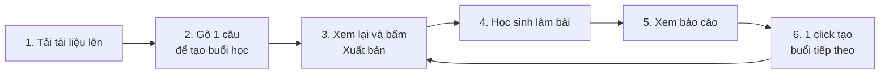
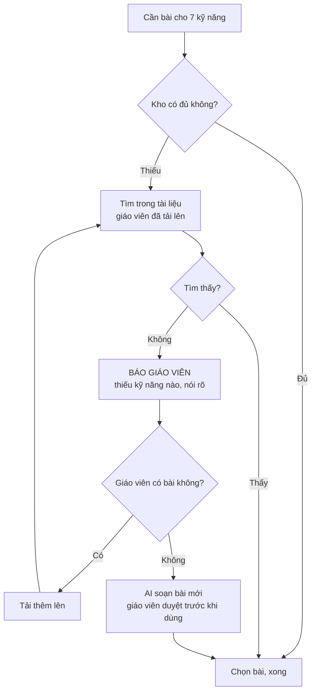

# Teacher Module — Tổng quan

> Dành cho người không làm kỹ thuật: product, kinh doanh, giáo viên cố vấn chuyên môn.
> Bản kỹ thuật đầy đủ: `TEACHER_MODULE_SPEC.md`.

---

## 1. Bài toán đang giải

Giáo viên soạn một buổi học mất rất nhiều thời gian, mà phần tốn công nhất không phải là viết — là **tìm đúng bài tập**.

Ba vấn đề cụ thể:

1. **Mục tiêu bài học mỗi người viết một kiểu.** Cùng bài "Đơn thức", giáo viên A viết *"Nhận biết đơn thức, thu gọn đơn thức, cộng trừ đơn thức đồng dạng"*, giáo viên B viết *"Học sinh nắm được khái niệm và biết rút gọn"*. Chương trình lại thay đổi thường xuyên.
2. **Máy không hiểu "thu gọn" khác "đồng dạng".** Hai cụm từ này gần nhau về mặt chữ nghĩa nhưng hoàn toàn khác nhau về chuyên môn. Nếu để AI tự đoán, nó sẽ chọn nhầm bài — hoặc tệ hơn, tự bịa ra bài không đúng trọng tâm.
3. **Báo cáo chung chung thì vô dụng.** Biết "em Nam được 6 điểm" không giúp gì. Cần biết **em Nam sai ở đâu** để hôm sau dạy lại đúng chỗ đó.

---

## 2. Ý tưởng cốt lõi: dán nhãn kỹ năng

Toàn bộ thiết kế xoay quanh một ý tưởng duy nhất: **chia nhỏ mục tiêu bài học thành danh sách kỹ năng cụ thể, rồi dán nhãn kỹ năng đó lên từng bài tập.**

Ví dụ thật, bài "Đơn thức" — Toán 8:

| Mục tiêu giáo viên viết | Hệ thống dịch thành các kỹ năng |
|---|---|
| "Nhận biết đơn thức, đơn thức thu gọn, hệ số, phần biến và bậc của đơn thức. Thu gọn đơn thức. Nhận biết đơn thức đồng dạng. Cộng và trừ hai đơn thức đồng dạng." | 1. Nhận biết đơn thức 2. Nhận biết đơn thức thu gọn 3. Xác định hệ số và phần biến 4. Xác định bậc của đơn thức 5. Thu gọn đơn thức 6. Nhận biết đơn thức đồng dạng 7. Cộng, trừ đơn thức đồng dạng |

Mỗi bài tập trong kho cũng được dán nhãn tương tự: *"bài này luyện kỹ năng số 5"*.

> **Ví von:** giống như dán nhãn thành phần dinh dưỡng lên từng món ăn, rồi soạn thực đơn theo nhu cầu của từng người. Không có nhãn thì chỉ đoán theo tên món — và tên món thì hay đánh lừa.

Có bộ nhãn này rồi thì làm được ba việc mà trước đây không làm được:

- **Ghép đúng bài với mục tiêu** — không đoán mò.
- **Nói thật khi thiếu** — *"kho không có bài nào cho kỹ năng Thu gọn đơn thức"*. Nếu để máy đoán theo độ giống nhau, nó luôn trả về một danh sách nào đó, **không bao giờ dám nói là không có**.
- **Biết học sinh yếu chỗ nào** — không phải "yếu môn Toán", mà "yếu kỹ năng Cộng trừ đơn thức đồng dạng".

---

## 3. Giáo viên trải nghiệm như thế nào

**Bước 1 — Tải tài liệu.** Giáo viên tải file đề bài lên, chọn môn – chương – bài, và chọn có chia sẻ cho giáo viên khác hay không. Xong. Hệ thống **chưa xử lý gì cả** — đây là chủ ý, giải thích ở mục 4.

**Bước 2 — Tạo buổi học bằng một câu.** Giáo viên gõ mục tiêu bằng ngôn ngữ bình thường của mình. Hệ thống dịch thành danh sách kỹ năng, rồi chọn bài tập từ kho.

**Bước 3 — Xem lại và xuất bản.** Hệ thống chỉ tạo **bản nháp**. Không có gì tới tay học sinh cho tới khi giáo viên bấm nút.

**Bước 4–5 — Học sinh làm bài, giáo viên xem báo cáo.** Báo cáo gồm: điểm trung bình, biểu đồ 3 nhóm học sinh (đã nắm / đang chật vật / chưa làm xong), **top 3 kỹ năng cả lớp yếu nhất**, và danh sách em cần giúp kèm lý do cụ thể.

**Bước 6 — Tạo buổi tiếp theo.** Xem mục 6.

---

## 4. Hệ thống làm gì phía sau

### Khi thiếu bài, hệ thống nói thật trước khi tự sáng tác

Đây là điểm quan trọng nhất về mặt chất lượng.

Thứ tự này có chủ ý: **bài của giáo viên luôn được ưu tiên hơn bài AI soạn.** AI chỉ vào cuộc khi đã hết cách, và bài AI soạn vẫn phải qua giáo viên duyệt.

### Tài liệu chỉ được xử lý khi thực sự cần

Một file đề thường có 30–50 bài, nhưng một buổi học chỉ dùng 4 bài. Nếu xử lý cả file ngay lúc tải lên, ta trả tiền cho 46 bài không ai đụng tới.

Nên hệ thống làm ngược lại: **để nguyên file, chỉ xử lý bài nào thực sự được chọn.** Bài đã xử lý một lần thì lưu lại vĩnh viễn, không làm lại lần hai.

| Cách làm | Chi phí |
|---|---|
| Xử lý hết ngay lúc tải lên | Trả tiền cho cả bài không dùng ❌ |
| Xử lý lại mỗi lần cần | Trả tiền lặp đi lặp lại ❌ |
| **Xử lý khi cần + lưu lại** | **Mỗi bài trả tiền đúng 1 lần** ✅ |

### Kho bài tập dùng chung

Kho **không** chia riêng theo từng giáo viên — người mới vào sẽ không có gì để dùng, mà đó chính là thứ kho sinh ra để tránh.

Thay vào đó: một kho chung, giáo viên chọn chia sẻ hay giữ riêng **cho từng tài liệu**. Khi soạn bài, **bài của chính giáo viên đó được ưu tiên xếp trước** bài của người khác — để buổi học vẫn mang giọng của họ.

---

## 5. Trợ lý AI cho giáo viên

Một trợ lý chat duy nhất, dùng chung cho mọi lớp. Nó tự biết bối cảnh: lớp nào, đã dạy tới đâu, học sinh đang yếu gì.

**Trợ lý làm được:**
- Tạo buổi học từ một câu mô tả
- Soạn thêm bài tập (về nhà, luyện thêm, phụ đạo, nâng cao)
- Đọc và giải thích báo cáo
- Gợi ý bước tiếp theo

**Trợ lý KHÔNG làm được — và đây là chủ ý:**
- ❌ **Không tự xuất bản bài cho học sinh.** Nút Xuất bản chỉ giáo viên bấm được.
- ❌ **Không tự đưa bài AI soạn vào buổi học** khi giáo viên chưa duyệt.

Ranh giới này cố định, không phải tùy chọn có thể tắt.

---

## 6. Buổi học tiếp theo: hai trục, không phải ba lựa chọn

Sau mỗi buổi học, hệ thống đề xuất bước tiếp theo. Điểm dễ hiểu nhầm: đây **không phải** chọn một trong ba.

| Đề xuất | Dành cho ai | Khi nào xuất hiện |
|---|---|---|
| **Học tiếp** bài mới | cả lớp | mặc định |
| **+ Buổi phụ đạo** | nhóm đang chật vật | khi nhóm này không rỗng |
| **+ Buổi nâng cao** | nhóm đã nắm vững | khi nhóm này không rỗng |

**Phụ đạo và nâng cao độc lập với nhau.** Lớp phân hóa mạnh thì có **cả hai cùng lúc**; lớp đều thì **không có cái nào**. Một lần báo cáo có thể sinh ra 1, 2 hoặc 3 bản nháp buổi học.

Buổi phụ đạo và nâng cao chỉ gửi cho **nhóm học sinh liên quan**, không gửi cả lớp. Giáo viên cũng xuất bản riêng từng buổi — có thể xuất bản buổi chính mà giữ buổi phụ đạo lại.

Phụ đạo dựa trên quan hệ kỹ năng: em nào yếu *"Cộng trừ đơn thức đồng dạng"* thì được lùi về luyện *"Nhận biết đơn thức đồng dạng"* trước — vì kỹ năng sau là nền của kỹ năng trước.

Nhóm **chưa làm xong** không sinh buổi học nào, chỉ nhắc giáo viên — chưa đủ dữ liệu để kết luận em đó yếu hay mạnh.

---

## 7. Việc cần người làm, không phải máy

Đây là phần cần nói thẳng: **hệ thống chỉ tốt bằng bộ khung kỹ năng mà con người soạn ra.**

Bộ khung này là **công việc chuyên môn sư phạm**, không phải việc kỹ thuật. Nó quyết định chất lượng của mọi thứ phía sau, và sửa về sau rất tốn kém vì dữ liệu học tập của học sinh đã gắn vào đó.

**Nguyên tắc quan trọng nhất là độ mịn.** Mỗi kỹ năng phải là một thứ học sinh có thể đúng hoặc sai một cách độc lập:

| Quá thô ❌ | Vừa ✅ | Quá mịn ❌ |
|---|---|---|
| "Làm bài về đơn thức" | "Thu gọn đơn thức" | "Thu gọn đơn thức có đúng 2 biến" |

- **Quá thô** → không biết học sinh yếu chính xác chỗ nào, báo cáo vô dụng.
- **Quá mịn** → mục tiêu nào cũng báo thiếu bài, giáo viên bị làm phiền liên tục.

Tham chiếu: **4–8 kỹ năng cho mỗi bài học.**

Bộ khung được lưu dưới dạng file văn bản dễ sửa, có lịch sử thay đổi — vì chương trình giáo dục Việt Nam giai đoạn này thay đổi thường xuyên, cần sửa nhanh mà vẫn kiểm soát được ai sửa gì.

---

## 8. Hiện trạng và giới hạn

> Phần hỗ trợ application/domain/infrastructure đã được triển khai; NestJS vẫn cần
> nối các use case vào product flow.

**Đã có:** kho bài rời, taxonomy/goal closed-set, lazy document extraction,
lesson draft/publish gate, mastery idempotent, báo cáo theo kỹ năng, follow-up
độc lập, migration/index tooling, và chatbot giáo viên tại
`POST /teacher/copilot/chat`.

**Các gate còn lại:**

| Hạng mục | Hiện trạng |
|---|---|
| Nội dung khung kỹ năng | Đa thức mới có 7 skill của bài Đơn thức; 4 concept còn lại chờ nội dung do người dùng cung cấp |
| Pilot mục tiêu thật | Chờ chạy với 20 lesson goal thật |
| NestJS mastery wiring | NestJS cần gọi `MasteryService.record` bằng `evidence_id`, sau đó invalidate context của lớp |
| Production migration rehearsal | Tooling đã có, chưa chạy trên bản sao Mongo/Redis production-shaped |
| LLM adherence review | Cần chạy với provider/model cấu hình thực tế |

**Cách triển khai đã chốt:** làm trọn vẹn **một chương** (Đa thức, 5 bài) và chạy thử với **20 mục tiêu bài học thật** trước, rồi mới nhân rộng. Lý do: độ mịn đúng hay sai chỉ lộ ra khi gặp mục tiêu thật của giáo viên. Sai độ mịn sau khi đã soạn xong 250 kỹ năng thì phải sửa lại cả 250.

**Giới hạn cần biết trước:**

| Giới hạn | Ý nghĩa thực tế |
|---|---|
| File PDF scan, công thức dạng ảnh | Hệ thống không đọc được, sẽ báo "cần xử lý tay" thay vì đoán bừa |
| Chất lượng kho phụ thuộc tài liệu đầu vào | Tài liệu tốt → buổi học tốt |
| Chưa có taxonomy ngoài phần đã seed | Cấu trúc đã sẵn sàng, cần người có chuyên môn soạn nội dung |

---

## 9. Tóm tắt một đoạn

Teacher module biến mục tiêu bài học — vốn là câu chữ tự do, mỗi giáo viên viết một kiểu — thành **danh sách kỹ năng chuẩn hóa**, rồi dùng danh sách đó để chọn đúng bài tập, chỉ ra chính xác học sinh yếu chỗ nào, và tạo buổi học tiếp theo phù hợp. Giáo viên giữ quyền quyết định ở mọi bước: AI soạn nháp, giáo viên duyệt và xuất bản. Điều kiện để chạy tốt là bộ khung kỹ năng phải được soạn cẩn thận bởi người có chuyên môn sư phạm — đó là phần việc quan trọng nhất và cũng là phần máy không làm thay được.
